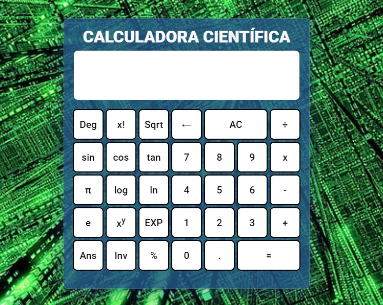

# Bienvenido a Calculadora Científicica

Este proyecto es parte del Proyecto final de cursado de JavaScript. En el mismo debíamos aplicar lo aprendido, por lo cual, aquí encontrarán aplicado control de flujos, ciclos, funciones, objetos, clases, arrays, funciones de orden superior, manejo del DOM, eventos, storage, JSON, promesas y el uso de alguna librería como SweetAlert y Toastify.

Si bien no es necesario para una calculadora web realizar un logín, el mismo es parte de las rúbricas.

Para ingresar podrás hacerlo con los siguientes datos:

Nombre: pedro
Clave: 4321

Nombre: pablo
Clave: 1234

## Clonar el repositorio:

Si quieres tener una copia del Proyecto debes clonar el repositorio en tu laptop o pc de escritorio y ejecutar algunas acciones que se indicarán a continuación para poder visualizarlo, hacer pruebas y por qué no, obtener algunas ideas para tu proyecto.

Para clonar el repositorio, ingresa el siguiente comando en tu consola:

### $ git clone (link del repositorio)

## Para comenzar

Una vez clonado el repositorio, podrás visualizar la calculadora científica haciendo doble click en index.html.

## Funcionamiento

El funcionamiento de la calculadora es bastante intuitivo, no obstante, a continuación dejamos un link con un video.

https://www.loom.com/share/6d3ba3a6d5b045238a86bf3e016877f8

## Deployment

Podrás acceder directamente desde github pages con el siguiente link: [https://pablomilitello.github.io/CalculadoraWeb/](https://pablomilitello.github.io/CalculadoraWeb/)
